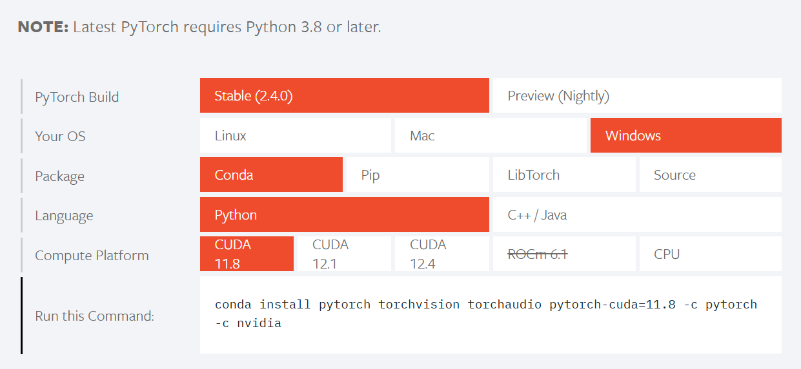

# Image Detection from YoloV8

This project is designed to run object detection using the YOLOv8 model. The code includes preprocessing steps, running the YOLOv8 detector, and will later include post-processing.

##  Repository Setup

### Prerequisites

Before you start, ensure you have the following software installed:

- Python 3.10
- `Cuda` 11.8
- `Conda` package manager (optional but recommended)

### Environment Setup

#### Step 1: Clone the Repository

First, clone this repository to your local machine.

```bash
cd imagedetectionyolov8
```
#### Step 2: Create the Environment

If you have a `yaml` environment file, you can create the environment using:

```bash
conda env create -n yolov8 -f environment.yaml
```

This will create a new `conda` environment with all the necessary dependencies.

```bash
conda activate yolov8
```

Alternatively, you can create the environment manually:

You can create the environment using:

```bash
conda create --name yolov8 python=3.8
```
Download `PyTorch` 2.5.0. (https://pytorch.org/)
If you have a CUDA graphic card, we recommend installing `pytorch` with 'CUDA' (pay attention to the CUDA version). If not, install the 'CPU' as shown in the image.



and check the `cuda` is available.

```bash
import torch

torch.cuda.is_available()
```

After creating the environment, install YOLOv8:

```bash
pip install ultralytics
```
    
** Then, install the other dependencies using the `enviorement.yaml` file.

#### Step 3: Activate the Environment

Activate the `conda` environment:

```bash
conda activate yolov8
```

## Running the Code

To run the main Python script, use the following command in your terminal:

```bash
python main_image_detection.py \
    --data_type <DATA_TYPE> \ 
    --main_directory <MAIN_DIRECTORY> \
    --num_process <NUM_PROCESS> \
    --source_EPSG <EPSG_CODE> \
    --model_weights <MODEL_WEIGHTS_PATH> \
    --model_parameters <MODEL_PARAMETERS_PATH> \
    --city_id <CITY_ID> \
    --job_id <JOB_ID> \
    --main_url <MAIN_URL>\
    --token <TOKEN>
```

### Arguments

- `--data_type`: Specify the data type. Choices are `Cyclomedia-Equirectangle-Eski`, `Cyclomedia-Equirectangle-Yeni`, `Cyclomedia-Cubemap-Karo`, `Navvis`, or `KGM`.
- `--main_directory`: The main directory where your data is stored.
- `--num_process`: The number of processes to use for multiprocessing.
- `--source_EPSG`: EPSG code for the source coordinate system. 
- `--model_weights`: Path to the YOLO model.
- `--model_parameters`: YOLO model parameters. 
- `--city_id`: RecID of the City.
- `--job_id`: Job ID for the process.
- `--main_url`: Main URL
-  `--token`: Token

#### Example Command

Here is an example command with the some values provided:

## TODOs
- The `cudnn` error will be mentioned in the YOLOV8 installation instructions.
- Develop for Other Data Types
- Error Handling and Validation
- Develop Post-Processing 
